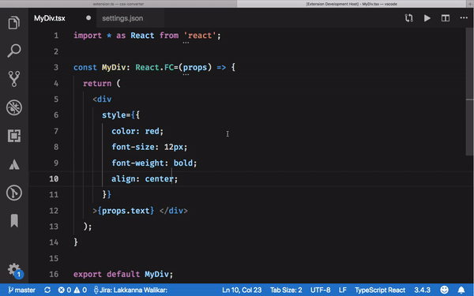

# CSS Converter

VS Code extension to convert a kebab-case css to camel case css or vice-versa. 

### If you like 👍 give stars ⭐️ in [Github](https://github.com/Lakkanna/css-converter) and [VS Code Marketplace](https://marketplace.visualstudio.com/items?itemName=Lakkannawalikar.css-converter&ssr=false#review-details).

## How to use
  * **Using keybinding**

  1. Select the CSS text you want convert
  2. Enter `Shift + Command + V` *(mac)*,   `Shift + Ctrl + V` *(windows/linux)*

  * **Using Command Pallette**

  1. Select the CSS text you want convert
  2. Open  `Command Pallette (Shift + Command + P) / (Shift + Control + P)` in VS-Code and enter `CSS Converter`
  3. Select `CSS Converter` from searched result
  4. **How's the josh** your css is converted.

  **To turn off autoFormat add configuration in settings.json**

  `"cssConverter.autoFormat": false,`

  **If you want to turn on autoFormat add configuration in settings.json**

  `"cssConvert.autoFormat": true,`  *(optional)*

  `"javascript.format.insertSpaceBeforeAndAfterBinaryOperators": false,`
  
  `"typescript.format.insertSpaceBeforeAndAfterBinaryOperators": false,`

## Example
  ### **kebab-case to camelCase**
    background-color: #FFF;   ===>   backgroundColor: "#FFF",

  ### **camelCase to kebab-case**
    backgroundColor: "#FFF",   ===>   background-color: #FFF;

## Features

* Convert your html css to jsStyle which support in react style elements.

* Auto identifies CSS style format.

## Known Issues

* Additional space after value # (example: backgroundColor: "#FFF",  ===>  background-color: # FFF;)

## Release Notes

## [0.1.4] - 2019-11-24
### Changed
- Removed unwanted libraries
- Project re-structured

## [0.1.3] - 2019-11-23
### Fixed
- Extension activation

## [0.1.2] - 2019-05-21
### Added
- Configuration for travis-ci
- Tests for build in travis-ci
- Badges in README.md
- Keywords
### Changed
- CHANGELOG.md
- README.md

## [0.1.1] - 2019-05-18
### Added
- Key binding

  *mac* - `Shift + Command + V`

  *window/linux* - `Shift + Ctrl + V`

## [0.1.0] - 2019-05-18
### Added
- Key binding

## [0.0.9] - 2019-05-17
### Changed
- Moved demo gif top in Updated README.md

## [0.0.8] - 2019-05-17
### Changed
- Updated README.md

## [0.0.7] - 2019-05-17
### Added
- Added configuration for format, default value will be true, to turn off auto format add `cssConverter.autoFormat: false` in **settings.json**

## [0.0.6] - 2019-05-17
### Fixed
- Fixed camelCase CSS string with comma separated values issue

## [0.0.5] - 2019-05-17
### Fixed
- Format should apply only for selected range

## [0.0.4] - 2019-05-17
### Fixed
- Auto indentaion issue
- Additional double quotes if try to convert kebab-case css to camelCase

## [0.0.3] - 2019-05-16
### Added
- Black background how to use gif in readme

## [0.0.2] - 2019-05-14
### Added
- How to use gif in readme

## [0.0.1] - 2019-05-14
### Added
- Initial release of CSS Converter
- Identifies format of css and converts it to kebab-case or camelCase based on which css format we selected.

-----------------------------------------------------------------------------------------------------------

**Enjoy!**
